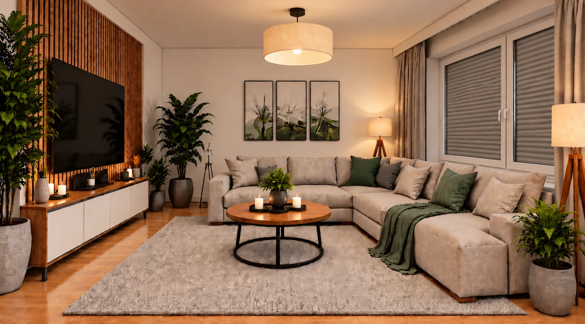

# Atze Dashboard Strategy
<sub>KI-Generiert: ChatGPT</sub>



Eine automatische Home-Assistant-Dashboard-Strategy im Apple-Home-inspirierten
Stil. Räume und Entities werden automatisch aus Home Assistant erzeugt und über
YAML-Overrides angepasst.

Das Projekt wird aktiv weiterentwickelt. Funktionen und Darstellung können sich bis zu einer finalen Version noch ändern.

## Aktueller Stand

Version **0.337.0**

Enthalten sind unter anderem:

- automatische Raumansichten
- Apple-Home-inspirierte Deckseite mit Raumbildern
- Bubble-Card-Unterstützung
- Fenster-, Rollladen-, Schloss- und Leistungsstatus auf den Raumbildern
- labelbasierte Sicherheitsansicht
- Wartungs-/Batterieansicht nach Räumen
- Kiosk-Mode-Unterstützung
- automatische Popups und technische Detailansichten
- grafische Auswahl der sichtbaren Räume und Entitäten
- konfigurierbare Favoriten zwischen Status- und Raumkacheln
- frei konfigurierbare eigene Dashboard-Seiten
- automatische Navigationsbuttons zu eigenen Seiten auf der Startseite
- optionales Zeitpläne-Bubble-Popup mit Scheduler Card
- optionales Lichtsteuerungs-Bubble-Popup aus einer eigenen Seite
- dynamische Raumbilder abhängig von Tag/Nacht und – je nach Bereich – Licht-, Fenster-, Tür-, Schloss- und Rollladenstatus
- automatischer HACS-Update-Hinweis auf der Startseite

## Installation über HACS

Dieses Repository wird in HACS als **Dashboard** / Plugin hinzugefügt.

1. HACS öffnen.
2. Oben rechts `⋮` → **Custom repositories**.
3. Repository-URL eintragen.
4. Typ **Dashboard** wählen.
5. Repository hinzufügen und herunterladen.
6. Home Assistant Frontend neu laden.

Die Resource lautet nach der Installation normalerweise:

```text
/hacsfiles/atze-dashboard-strategy/atze-dashboard-strategy.js
```

HACS verwaltet die Resource bei aktuellen Home-Assistant-/HACS-Versionen in der
Regel automatisch.

## Voraussetzungen / empfohlene Erweiterungen

Für die vollständige Funktion der Strategy werden bzw. empfehlen sich folgende
Home-Assistant-Erweiterungen. Am einfachsten werden sie über **HACS**
installiert.

### HACS — empfohlen

Installation und Updates der Strategy sowie der meisten Zusatzkarten.

[HACS](https://www.hacs.xyz/)

### Bubble Card — erforderlich

Wird für Raumkarten, Climate-Karten und Bubble-Popups der Strategy benötigt.

[GitHub – Clooos/Bubble-Card](https://github.com/Clooos/Bubble-Card)  
In HACS nach **Bubble Card** suchen.

### Bubble Card Tools — empfohlen

Backend für den Bubble-Card Module Store und die Modulverwaltung.

[GitHub – Clooos/Bubble-Card-Tools](https://github.com/Clooos/Bubble-Card-Tools)  
In HACS nach **Bubble Card Tools** suchen.

### card-mod — empfohlen / optional

Für zusätzliche CSS-Anpassungen und das Styling von Home-Assistant-Karten.

[GitHub – thomasloven/lovelace-card-mod](https://github.com/thomasloven/lovelace-card-mod)  
In HACS nach **card-mod** suchen.

### Kiosk Mode — optional

Zum Ausblenden von Header und Sidebar bei Wand- und Kiosk-Displays.

[GitHub – 00-10-01-11/ha-kiosk-mode](https://github.com/00-10-01-11/ha-kiosk-mode)  
In HACS nach **Kiosk Mode** suchen.

### Scheduler Card — optional

Wird für das optionale Zeitpläne-Bubble-Popup benötigt.

[GitHub – nielsfaber/scheduler-card](https://github.com/nielsfaber/scheduler-card)  
In HACS nach **Scheduler Card** suchen.

### Scheduler Component — optional

Backend/Integration für die Scheduler Card.

[GitHub – nielsfaber/scheduler-component](https://github.com/nielsfaber/scheduler-component)  
In HACS nach **Scheduler Component** suchen.

### Alarmo — optional

Liefert den Alarmstatus für die Alarmo-Kachel auf der Startseite.

[GitHub – nielsfaber/alarmo](https://github.com/nielsfaber/alarmo)  
In HACS nach **Alarmo** suchen.

### Was davon ist wirklich nötig?

Für die Grundfunktionen des Dashboards ist **Bubble Card** die wichtigste
externe Abhängigkeit. **Bubble Card Tools**, **card-mod** und **Kiosk Mode**
erweitern bzw. vereinfachen das Setup, werden aber nicht für jede Funktion der
Strategy zwingend benötigt.

**Scheduler Card** und **Scheduler Component** brauchst du nur, wenn das
optionale Zeitpläne-Popup verwendet werden soll. **Alarmo** ist ebenfalls nur
notwendig, wenn die Alarmo-Anzeige genutzt wird; ist keine passende Entität
vorhanden, wird die Kachel automatisch ausgeblendet.

## Blueprint Lichtsteuerung

Der Blueprint liegt im Repository zusätzlich als gut sichtbare Quelldatei unter:

`blueprints/lichtsteuerung.yaml`

Beim Laden der Dashboard-Strategy prüft ein Home-Assistant-Admin automatisch,
ob der Automation-Blueprint in Home Assistant vorhanden ist. Fehlt er, wird er
über die Home-Assistant-Blueprint-API angelegt und anschließend nochmals
verifiziert.

Der Zielpfad in Home Assistant ist:

`/config/blueprints/automation/atze dashboard strategy/lichtsteuerung.yaml`

Home Assistant erzeugt die fehlenden Unterordner beim Speichern automatisch.
Der Blueprint verwendet die von der Strategy fest angelegten Helfer für
**Aktivierung, Startzeiten, Helligkeit und Farbtemperatur** automatisch. Beim
Erstellen einer Automation müssen deshalb nur noch die Lampen sowie die drei
raumbezogenen Zeitversätze für **Morgen**, **Abend** und **Nacht** ausgewählt
werden. Die Zeitversätze werden direkt in der jeweiligen Blueprint-Automation
gespeichert; dafür sind keine zusätzlichen Helfer nötig.

Ändert sich die mitgelieferte Blueprint-Version, aktualisiert die Strategy den
bereits in Home Assistant vorhandenen Blueprint automatisch.

### Lichtsteuerung V2 ohne Helfer

Als eigenständige Alternative liegt zusätzlich folgende Blueprint-Datei im
Repository:

`blueprints/lichtsteuerung-v2.yaml`

Bei dieser Variante werden Startzeit, Helligkeit und Farbtemperatur für
**Morgen**, **Abend** und **Nacht** direkt beim Erstellen der Automation
eingetragen. Sie verwendet keine Home-Assistant-Helfer und enthält keine
Zeitversätze. Aktiviert und deaktiviert wird sie über den normalen Schalter der
erstellten Automation. Die vorhandene Lichtsteuerung bleibt unverändert. Ab Version **0.189.0** werden
sowohl V1 als auch V2 automatisch von der Dashboard-Strategy installiert und
bei Änderungen aktualisiert.

## Dashboard-YAML

Die Strategy wird direkt verwendet – **kein äußeres `strategy:`**:

```yaml
type: custom:atze-dashboard
```

Eine vollständige Beispielkonfiguration befindet sich in `example.yaml`.

## Entwicklung

Die bearbeitbaren Quelldateien liegen in `src/`; die Datei in `dist/` ist das
von HACS geladene Ergebnis. Die Versionsnummer wird ausschließlich über
`ATZE_VERSION` in `src/00-core.js` gepflegt. Nach Änderungen in `src/`
erzeugt die GitHub Action automatisch `dist/atze-dashboard-strategy.js` und
synchronisiert dieselbe Versionsnummer nach `package.json` sowie in den
Abschnitt **Aktueller Stand** dieser README. Lokal lässt sich derselbe Schritt
bei Bedarf mit `npm run build` ausführen.

## Raum-Bilder

Die mitgelieferten Bilder liegen unter `dist/assets/` und werden automatisch
den passenden Home-Assistant-Bereichen zugeordnet. Für eine zuverlässige
Erkennung empfiehlt es sich, die folgenden Standardnamen zu verwenden.
Die fett geschriebenen Namen sind die empfohlenen Bezeichnungen; die darunter
aufgeführten Namen werden von der Strategy als Alias demselben Bereich
zugeordnet.

| Bereich in Home Assistant | Zuordnung der Strategy | Asset-Ordner |
| --- | --- | --- |
| **Wohnzimmer** | `wohnzimmer` | `dist/assets/wohnzimmer/` |
| **Schlafzimmer** | `schlafzimmer` | `dist/assets/schlafzimmer/` |
| **Küche** | `kuche` | `dist/assets/kueche/` |
| **Bad** | `bad` | `dist/assets/bad/` |
| **Flur** | `flur` | `dist/assets/flur/` |
| **Hausflur** | `hausflur` | `dist/assets/hausflur/` |
| Treppenhaus | `hausflur` | `dist/assets/hausflur/` |
| Treppenflur | `hausflur` | `dist/assets/hausflur/` |
| **Büro** | `buro` | `dist/assets/buro/` |
| Arbeitszimmer | `buro` | `dist/assets/buro/` |
| **Kinderzimmer** | `kinderzimmer` | `dist/assets/kinderzimmer/` |
| Spielzimmer | `kinderzimmer` | `dist/assets/kinderzimmer/` |
| **Balkon** | `balkon` | `dist/assets/balkon/` |
| Veranda | `balkon` | `dist/assets/balkon/` |
| **3D-Drucker** | `3d_drucker` | `dist/assets/3d-drucker/` |
| **Zentrale** | `zentrale` | `dist/assets/zentrale/` |

Beispiel: Ein Home-Assistant-Bereich mit dem Namen **Arbeitszimmer** wird wie
**Büro** behandelt und verwendet die Bilder aus `dist/assets/buro/`.
Entsprechend werden **Spielzimmer** als **Kinderzimmer** sowie **Veranda** als
**Balkon** behandelt.

## Sicherheit

Die Ansicht `sicherheit` übernimmt alle Entities mit dem Home-Assistant-Label
**Sicherheit** und gruppiert sie nach Bereichen.

## Wartung

Die Ansicht `wartung` erkennt Batteriesensoren automatisch und gruppiert sie
nach **Gut (41–100 %)**, **Niedrig (21–40 %)** und **Kritisch (0–20 %)**.
Innerhalb der Abschnitte stehen die niedrigsten Ladestände zuerst.

## Qualitätssicherung

Vor einem Pull Request kann lokal mit `npm run validate` dieselbe grundlegende Prüfung wie in GitHub Actions ausgeführt werden. Dabei werden Bundle und Version synchronisiert, die JavaScript-Syntax geprüft, alle im Source referenzierten Bilddateien kontrolliert und die festgelegten Raum-Aliase getestet.

## Screenshots

Für die Projektdokumentation sind echte Screenshots der laufenden Home-Assistant-Oberfläche vorgesehen. So werden Darstellung und Funktionen nicht mit Beispiel- oder generierten Bildern verwechselt. Screenshots können bei UI-Änderungen über Pull Requests ergänzt bzw. aktualisiert werden.

## Letzte Änderungen

<!-- latest-changes:start -->
## v0.337.0
- Rauchmelder-Icon innerhalb des Kreises auf der Hauptseite um 1 px nach oben ausgerichtet.

## v0.336.0
- Rauchmelder auf der Hauptseite verwenden jetzt das rundere `mdi:smoke-detector-variant` Symbol passend zur gewählten Darstellung.

## v0.335.0
- Rauchmelder-Badges aus den Bereichskarten entfernt.
- Rauchmelderstatus stattdessen auf der passenden Raumkarte der Hauptseite oben rechts als kompaktes Icon dargestellt.
- Normalzustand grün, Alarmzustand rot; ohne zusätzlichen Text.
<!-- latest-changes:end -->

## Lizenz

MIT
